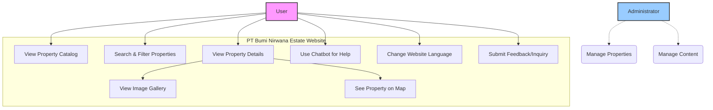

# Project Documentation: PT Bumi Nirwana Estate - Client Application

## 1. Project Overview

This project is the client-facing web application for "PT Bumi Nirwana Estate," a real estate company. It is a modern, multilingual website designed to showcase property listings. The application is built with Next.js, providing server-side rendering (SSR) and static site generation (SSG) for performance and SEO benefits.

Key features include:
- A comprehensive property catalog with filtering and sorting.
- Detailed property pages with image galleries and specifications.
- Internationalization (i18n) supporting English, Indonesian, Russian, and Ukrainian.
- A custom-built chatbot for user assistance.
- A separate Node.js/Express server to handle backend logic, data processing, and API requests.

---

## 2. Technology Stack

The project utilizes a comprehensive stack for both frontend and backend components.

### 2.1. Frontend
- **Framework:** [Next.js](https://nextjs.org/) (v13.1.1) with [React](https://reactjs.org/) (v18.2.0)
- **Language:** [TypeScript](https://www.typescriptlang.org/)
- **Styling:**
    - [Sass/SCSS](https://sass-lang.com/) for structured styling, with global variables and mixins.
    - [classnames](https://github.com/JedWatson/classnames) utility for conditional classes.
- **State Management:**
    - React Context API (`src/context`) for managing global state like catalog data and header status.
    - Custom Hooks (`src/hooks`) for abstracting data fetching and other reusable logic.
- **Internationalization (i18n):**
    - [ni18n](https://github.com/i18next/ni18n) and `react-i18next` for managing translations.
    - Language JSON files are located in `public/locales`.
- **Mapping:**
    - [Leaflet](https://leafletjs.com/) and [React Leaflet](https://react-leaflet.js.org/) for displaying property maps.
    - [@maptiler/leaflet-maptilersdk](https://www.maptiler.com/sdk-js/) for map services.
- **UI Components & Libraries:**
    - [Nuka Carousel](https://github.com/FormidableLabs/nuka-carousel) and [React Slick](https://react-slick.neostack.com/) for image sliders/carousels.
    - [React Image Gallery](https://github.com/xiaolin/react-image-gallery) for property photo galleries.
    - [React Masonry CSS](https://github.com/eiriklv/react-masonry-css) for grid layouts.

### 2.2. Backend (Server-Side Component)
- **Environment:** [Node.js](https://nodejs.org/)
- **Framework:** [Express.js](https://expressjs.com/)
- **Database:**
    - [MySQL](https://www.mysql.com/) (`mysql` driver).
    - [PostgreSQL](https://www.postgresql.org/) (`pg` driver) is also listed as a dependency, suggesting potential use or integration.
- **API Communication:**
    - The Next.js app communicates with this Express server.
    - [Axios](https://axios-http.com/) is used for making HTTP requests from the client to the backend.
- **Image Processing:**
    - [Sharp](https://sharp.pixelplumbing.com/) for high-performance image processing (resizing, optimization).
    - A dedicated script `server-side/processPropertyImages.js` handles this.

### 2.3. Tooling & Development
- **Package Manager:** `npm` (inferred from `package-lock.json`) and `yarn` (`yarn.lock` also present).
- **Linting & Formatting:**
    - [ESLint](https://eslint.org/) for code quality and linting.
    - [Prettier](https://prettier.io/) for automated code formatting.
- **Development Server:**
    - `concurrently` is used to run the Next.js development server and the backend Express server simultaneously.
- **Deployment:** The `scripts` in `package.json` suggest a deployment process involving `git pull`, `next build`, and running the servers in a production environment.

---

## 3. Project Structure

The project is organized into several key directories, separating concerns between the Next.js application, the backend server, and public assets.

```
/
├── .next/              # Next.js build output
├── node_modules/       # Project dependencies
├── public/             # Static assets
│   ├── assets/         # Images, icons, fonts
│   └── locales/        # i18n translation files (en, id, ru, ua)
├── server-side/        # Custom Node.js/Express backend
│   ├── database.js     # Database connection logic
│   ├── main.js         # Express server entry point
│   ├── routes.js       # API route definitions
│   └── ...
├── src/                # Main application source code
│   ├── assets/         # SCSS files and component-specific assets
│   ├── context/        # React Context providers
│   ├── hooks/          # Custom React hooks
│   ├── modules/        # Feature-based modules (e.g., chatbot, layout)
│   ├── pages/          # Next.js pages and API routes
│   ├── types/          # TypeScript type definitions
│   └── utils/          # Utility functions and constants
├── next.config.js      # Next.js configuration
├── package.json        # Project dependencies and scripts
└── tsconfig.json       # TypeScript configuration
```

---

## 4. Key Workflows

### 4.1. Running the Project
The project requires running two processes at once: the Next.js frontend and the Express backend.

- **Development:**
  ```bash
  npm run dev
  ```
  This command uses `concurrently` to start the Express server (`node server-side/main.js`) and the Next.js dev server (`next dev -p 3001`).

- **Production:**
  ```bash
  npm run build
  npm run start
  ```
  `npm run build` creates an optimized production build of the Next.js app. `npm run start` then runs the built app and the backend server in production mode.

### 4.2. Data Fetching
- Client-side data fetching is primarily handled by custom hooks, notably `useDataFetching.tsx`.
- These hooks likely use `axios` to make API calls to the backend server running from the `server-side/` directory.
- The backend server then queries the database (MySQL/Postgres) and returns the data to the client.
- The `next.config.js` file configures image remote patterns, allowing Next.js's `<Image>` component to optimize images served from the backend (e.g., `http://localhost:5000`).

### 4.3. Internationalization (i18n)
- The `next.config.js` file defines the supported locales (`en`, `id`, `ru`, `ua`) and sets `id` as the default.
- The `ni18n.config.ts` file configures the `ni18n` library.
- Translation strings are stored in JSON files within `public/locales/{lang}/{namespace}.json`.
- The `useTranslation` hook from `react-i18next` is likely used within components to display translated text.

### 4.4. Routing
- Routing is managed by Next.js's file-system-based router located in `src/pages`.
- **Static Routes:** `index.tsx`, `about.tsx`, `catalog.tsx`, `services.tsx`.
- **Dynamic Routes:** `src/pages/catalog/[catalog].tsx` creates a dynamic page for each individual property listing (e.g., `/catalog/villa-mewah-1`).

---

## 5. System Diagrams

### 5.1. Use Case Diagram

This diagram illustrates the primary interactions a user can have with the system.



### 5.2. High-Level Component Interaction Diagram

This diagram shows how the main parts of the application interact.

```mermaid
graph TD
    subgraph "Browser (Client)"
        A[Next.js Pages (e.g., CatalogPage)]
        B[React Components (Filter, CardSlider, Map)]
        C[Custom Hooks (useDataFetching)]
        D[React Context (CatalogContext)]
    end

    subgraph "Backend Services"
        E[Node.js/Express Server (server-side/)]
        F[Database (MySQL/Postgres)]
        G[Image Storage]
    end

    A --> B
    A -- Uses Hook --> C
    B -- Consumes Context --> D
    C -- Fetches Data --> E
    D -- Provides Data --> B
    E -- Queries --> F
    E -- Serves/Processes Images --> G

    style A fill:#bbf,stroke:#333,stroke-width:2px
    style E fill:#f8d,stroke:#333,stroke-width:2px
```
