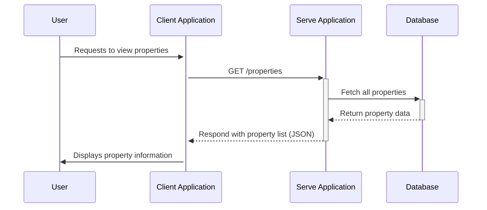

# Client Property Data Flow

This document explains how the `Client` application fetches and displays property data from the `serve` application.

## Data Flow Diagram

## Explanation

1.  **User Interaction**: The process begins when a user navigates to the property listings page in the `Client` application.
2.  **API Request**: The `Client` application sends an HTTP `GET` request to the `/properties` endpoint of the `serve` application to retrieve the list of properties.
3.  **Data Retrieval**: The `serve` application receives the request and queries the database to fetch all property records.
4.  **API Response**: The `serve` application formats the retrieved data into a JSON structure and sends it back to the `Client` application.
5.  **Render Properties**: The `Client` application parses the JSON response and dynamically renders the property information on the page for the user to view.

This flow ensures that the `Client` application always displays the most current property data available in the database.