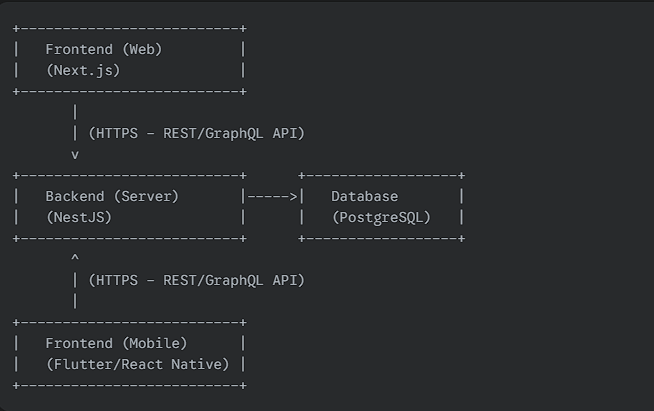

1. Ada dua _front-end_ yang akan pakai satu _back-end_ yang sama:

   - **Web** (React) – sudah ada versi awal (first initiation).
   - **Mobile** – masih perlu dibangun.

2. Fitur utama yang diminta SPV:

   - Aplikasi **katalog lengkap produk perumahan** berisi:
     - Gambar (foto, render 3D, dsb.)
     - Denah rumah (floor plan)
     - Harga
     - Maps lokasi (Google Maps / Mapbox)

3. Web sudah ada versi awal, tapi belum tentu sudah punya katalog yang lengkap seperti di atas.

4. Chatbot sudah ada di web; belum jelas apakah mobile juga perlu chatbot atau tidak.

Langkah cepat yang biasa saya lakukan untuk situasi seperti ini:

A. Konfirmasi dulu ke SPV

- Apakah **mobile app** nanti _native_ (Android/iOS) atau **React Native / Flutter**?
- Apakah chatbot juga harus hadir di mobile?
- Apakah data katalog yang ada di web sudah lengkap (gambar, denah, harga, maps) atau masih perlu di-_back-fill_?

B. Cek kesiapan back-end

- Endpoint apa saja yang sudah ada untuk katalog?
- Apakah sudah ada API untuk denah (mis. file .pdf/.jpg/.svg), lokasi (lat/long atau alamat), dan harga (real-time atau snapshot)?
- Jika belum, buat task list ke back-end team.

C. Struktur data katalog (sederhana)

```
Property {
  id: string
  name: string
  images: string[]   // URLs
  floorPlans: string[]
  price: number
  currency: 'IDR'
  location: {
    address: string
    lat: number
    lng: number
  }
}
```

D. Mobile stack yang cepat (opsi)

- **React Native** (karena tim sudah pakai React di web, reuse knowledge)
- State management: Redux Toolkit / Zustand
- Maps: `@react-native-maps` (Google Maps)
- Image viewer: `react-native-fast-image` + `react-native-image-zoom-viewer`
- PDF/image denah: `react-native-pdf` atau langsung WebView kalau cuma file.

E. Milestone MVP

1.  Week
    User: im fullstack developor in company estate, i have an project mobile and web, the web base on react for first initiation the mobile and web backend use same backend. then the web also using chatbot the SPV said in indonesian "Mungkin yg dibutuhkan aplikasi untuk akses katalog mas. Jadi di dalam aplikasi tersebut sudah lengkap informasi tentang semua product perumahan kami, meliputi gambar, denah rumah, harga, maps lokasi.". create plan and also tech stack for developing. use english
    Kimi: ESTATE-TECH ROADMAP  
    Project: Unified Web + Mobile Property Catalog (shared backend)

────────────────────────────────────────

1. GOAL (in 1 sentence)
   Deliver a single back-end that powers:

- an existing React web app (now extended with full catalog + chatbot)
- a brand-new mobile app that lets users browse every housing project with photos, floor plans, pricing and an interactive map.

──────────────────────────────────────── 2. SYSTEM OVERVIEW



──────────────────────────────────────── 3. TECH STACK DETAIL

Back-End

- Framework: NestJS (TypeScript) – same language as front-end, opinionated, fast.
- DB: PostgreSQL 15 (PostGIS for geo-queries).
- Object storage: MinIO (on-prem) or AWS S3 (cloud) for images/floor-plans.
- Cache & pub/sub: Redis (session, chatbot real-time).
- Search: Elasticsearch for “cari rumah di BSD under 1 M” queries.
- Auth: JWT (access) + refresh tokens, role: user / agent / admin.
- Realtime: Socket.io gateway (chatbot & price-change push).
- Docs: Swagger/OpenAPI + GraphQL codegen for front-ends.

Front-End Web

- Framework: Next.js 14 (App Router, React 18).
- Styling: TailwindCSS + HeadlessUI.
- State: Zustand (lightweight) + React-Query (server state).
- Maps: Mapbox GL JS (clustered pins, heat-maps).
- Chatbot: React-Chatbotify or custom UI wired to WebSocket.
- Image viewer: yet-another-react-lightbox + next/image.

  Animation base

  Based on my analysis of the website's HTML and CSS, the animations can be broken down into three main categories:

  CSS Transitions: The most common animations are simple transitions on interactive elements like buttons, links, and cards. These are handled by Tailwind CSS utility classes (e.g., transition-all, duration-300), which create smooth changes in properties like color, background, and shadows on hover or focus.

  Pre-built CSS Animations: The site uses standard animations provided by Tailwind CSS, including:

  bounce: For elements that need to grab attention, like a "scroll down" indicator.
  pulse: A subtle fading animation often used for loading skeletons or to indicate a live status.
  spin: A classic rotating animation used for loading spinners.
  Scroll-Triggered Animations: It is highly probable that the website uses a JavaScript library to trigger animations as you scroll. This is a very common technique in modern web design. As you scroll down the page, elements like text blocks, images, and entire sections likely fade in, slide into view, or scale up. These effects are typically orchestrated by libraries such as:

  Framer Motion: A very popular and powerful animation library for React.
  AOS (Animate On Scroll): A lightweight library specifically for scroll-triggered animations.
  GSAP (GreenSock Animation Platform): A professional-grade animation library for more complex and high-performance animations.
  In summary, the website's animations are a combination of simple CSS transitions for user interactions, a few standard CSS keyframe animations for emphasis, and almost certainly a JavaScript library to create engaging animations that are revealed on scroll.

Front-End Mobile

- Framework: Flutter 3.22 (Dart 3)
- Architecture: Clean Architecture + Riverpod (Generator)
- DI: get_it + injectable
- Routing: Auto_route (deep-links)
- Networking: Retrofit/Dio (REST) + Hive cache
- JSON: freezed + json_annotation
- Maps: google_maps_flutter + flutter_map fallback
- Image / PDF viewer: extended_image + flutter_pdfview + photo_view
- Local storage: Hive (favorites), flutter_secure_storage (tokens)
- Push: Firebase Cloud Messaging
- CI/CD: GitHub Actions → EAS-like via Flutter workflow
- OTA hot-fix: Shorebird

DevOps & Tooling

- Infra as Code: Terraform (AWS) or Ansible (on-prem).
- CI/CD: GitHub Actions → EAS (mobile) & Vercel (web).
- Tests: Jest + React-Testing-Library, Detox (E2E mobile), Playwright (web).
- Code quality: ESLint, Prettier, Husky pre-commit.
- Monitoring: Sentry (FE + BE), Prometheus + Grafana (infra).

──────────────────────────────────────── 4. DATA MODEL (simplified)

Property {
id: uuid PK
name: string
slug: string (SEO)
devPhase: enum (PreLaunch, ReadyStock, SoldOut)
images: string[] // presigned URLs
floorPlans: { name: string, url: string }[]
price: numeric(15,2)
priceUnit: enum (IDR, /month, /m²)
location: geography(Point,4326)
address: jsonb { street, city, province }
specs: jsonb { lt, lb, bedrooms, bathrooms }
createdAt, updatedAt
}

──────────────────────────────────────── 5. API CONTRACT (REST / GraphQL)

GET /v1/properties?page=&lat=&lng=&radius=  
GET /v1/properties/:id  
POST /v1/favorites (auth)  
WS /chatbot → { type: 'message', threadId, text }

GraphQL (if preferred)  
query Properties($filter: PropertyFilter) { ... }  
subscription PriceUpdated($propertyId: ID!) { ... }

──────────────────────────────────────── 6. 8-WEEK SPRINT PLAN (MVP)

Week 0 – Discovery

- Confirm scope, branding, non-functional (offline first? 3D tour?).

Week 1 – Back-End Skeleton

- NestJS project, auth module, DB schema, migrations.
- Seed 5 sample properties.

Week 2 – Image & File Service

- MinIO bucket, signed-upload endpoints, image resize Lambda/Sharp.
- CDN (CloudFront / Cloudflare).

Week 3 – Web Catalog Module

- Property list page (filters, pagination).
- Detail page with image gallery, map embed, price display.
- SEO: next-sitemap, dynamic meta tags.

Week 4 – Mobile Skeleton & Catalog

- Expo init, tab navigation (Home, Catalog, Favorites, Profile).
- Catalog screen = shared components with web (React-Native-Web compatible).

Week 5 – Maps & Geo Search

- PostGIS radius queries.
- Web: Mapbox clusters.
- Mobile: react-native-maps with custom callouts.

Week 6 – Chatbot Integration

- WebSocket gateway in NestJS.
- RAG-style bot (context = property FAQ + current listings).
- UI: floating chat bubble on web, tab screen on mobile.

Week 7 – Polish & QA

- Offline favorites caching on mobile.
- E2E tests (Playwright + Detox).
- Performance: image lazy-loading, code-splitting.

Week 8 – Release

- Web → production (Vercel).
- Mobile: internal TestFlight / Play Console Closed Testing.
- Collect feedback, plan v1.1 (360° tour, mortgage calculator).

──────────────────────────────────────── 7. RISK REGISTER

- Image storage cost → compress on upload, serve WebP.
- Location accuracy → use Google Place ID fallback.
- Chatbot hallucination → add “human hand-off” after 3 failed answers.
- Mobile store policy → no WebView-only app; ensure native navigation.

──────────────────────────────────────── 8. HAND-OFF CHECKLIST

☐ OpenAPI & GraphQL schema merged to main  
☐ .env.example & README for each repo  
☐ GitHub Actions badges green  
☐ Sentry DSN configured for staging & prod  
☐ App store assets (screenshots, privacy policy) ready

