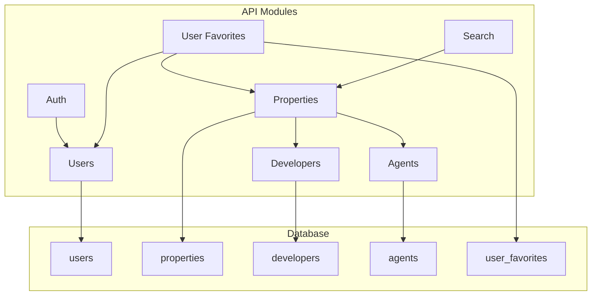

  

[circleci-image]: https://img.shields.io/circleci/build/github/nestjs/nest/master?token=abc123def456
[circleci-url]: https://circleci.com/gh/nestjs/nest

  
A progressive <a href="http://nodejs.org" target="_blank">Node.js</a> framework for building efficient and scalable server-side applications.

    

  
    
  

  <!--
  -->

# API Documentation

This document provides a comprehensive overview of the API endpoints, data models, and module relationships for the server application.

## 1. API Endpoints

### 1.1. Auth

-   `POST /auth/login`: Authenticates a user and returns a JWT.
-   `POST /auth/register`: Registers a new user.

### 1.2. Users

-   `GET /users`: Retrieves a list of all users.
-   `GET /users/profile`: Retrieves the profile of the currently authenticated user.
-   `GET /users/:id`: Retrieves a specific user by their ID.
-   `POST /users`: Creates a new user.
-   `PATCH /users/:id`: Updates a user's information.
-   `DELETE /users/:id`: Deletes a user.

### 1.3. Properties

-   `GET /properties`: Retrieves a list of all properties.
-   `GET /properties/:id`: Retrieves a specific property by its ID.
-   `POST /properties`: Creates a new property.
-   `PUT /properties/:id`: Updates a property's information.
-   `DELETE /properties/:id`: Deletes a property.
-   `POST /properties/:id/images`: Uploads images for a property.
-   `POST /properties/:id/floor-plans`: Uploads floor plans for a property.

### 1.4. Developers

-   `GET /developers`: Retrieves a list of all developers.
-   `GET /developers/:id`: Retrieves a specific developer by their ID.
-   `POST /developers`: Creates a new developer.
-   `PUT /developers/:id`: Updates a developer's information.
-   `DELETE /developers/:id`: Deletes a developer.

### 1.5. Agents

-   `GET /agents`: Retrieves a list of all agents.
-   `GET /agents/:id`: Retrieves a specific agent by their ID.
-   `POST /agents`: Creates a new agent.
-   `PUT /agents/:id`: Updates an agent's information.
-   `DELETE /agents/:id`: Deletes an agent.

### 1.6. User Favorites

-   `GET /user-favorites`: Retrieves the list of favorite properties for the currently authenticated user.
-   `POST /user-favorites`: Adds a property to the user's favorites.
-   `DELETE /user-favorites/:propertyId`: Removes a property from the user's favorites.

### 1.7. Search

-   `GET /search`: Searches for properties based on query parameters.

## 2. Data Models (Entities and DTOs)

### 2.1. Entities

#### `Agent`

| Field | Type | Description |
| :--- | :--- | :--- |
| `id` | `uuid` | Unique identifier for the agent. |
| `full_name` | `varchar(255)` | The full name of the agent. |
| `email` | `varchar(255)` | The email address of the agent (unique). |
| `phone_number` | `varchar(20)` | The phone number of the agent. |
| `avatar_url` | `text` | The URL of the agent's avatar. |
| `created_at` | `timestamptz` | The timestamp when the agent was created. |
| `updated_at` | `timestamptz` | The timestamp when the agent was last updated. |

#### `Developer`

| Field | Type | Description |
| :--- | :--- | :--- |
| `id` | `uuid` | Unique identifier for the developer. |
| `name` | `varchar(255)` | The name of the developer. |
| `logo_url` | `text` | The URL of the developer's logo. |
| `website_url` | `text` | The URL of the developer's website. |
| `created_at` | `timestamptz` | The timestamp when the developer was created. |
| `updated_at` | `timestamptz` | The timestamp when the developer was last updated. |

#### `Property`

| Field | Type | Description |
| :--- | :--- | :--- |
| `id` | `uuid` | Unique identifier for the property. |
| `developer` | `Developer` | The developer of the property. |
| `agent` | `Agent` | The agent associated with the property. |
| `name` | `varchar(255)` | The name of the property. |
| `slug` | `varchar(255)` | The unique slug for the property. |
| `status` | `PropertyStatus` | The status of the property (e.g., `AVAILABLE`, `SOLD_OUT`). |
| `price` | `numeric(18, 2)` | The price of the property. |
| `price_unit` | `PriceUnit` | The unit for the price (e.g., `TOTAL`, `PER_MONTH`). |
| `currency` | `varchar(3)` | The currency of the price (e.g., `IDR`). |
| `description` | `text` | A description of the property. |
| `location` | `geography` | The geographical location of the property. |
| `address` | `jsonb` | The address of the property. |
| `specifications` | `jsonb` | The specifications of the property. |
| `images` | `PropertyImage[]` | The images of the property. |
| `floor_plans` | `PropertyFloorPlan[]` | The floor plans of the property. |
| `created_at` | `timestamptz` | The timestamp when the property was created. |
| `updated_at` | `timestamptz` | The timestamp when the property was last updated. |

#### `PropertyFloorPlan`

| Field | Type | Description |
| :--- | :--- | :--- |
| `id` | `uuid` | Unique identifier for the floor plan. |
| `property` | `Property` | The property the floor plan belongs to. |
| `name` | `varchar(255)` | The name of the floor plan. |
| `file_url` | `text` | The URL of the floor plan file. |
| `sort_order` | `int` | The sort order of the floor plan. |

#### `PropertyImage`

| Field | Type | Description |
| :--- | :--- | :--- |
| `id` | `uuid` | Unique identifier for the image. |
| `property` | `Property` | The property the image belongs to. |
| `image_url` | `text` | The URL of the image. |
| `caption` | `varchar(255)` | The caption for the image. |
| `sort_order` | `int` | The sort order of the image. |

#### `User`

| Field | Type | Description |
| :--- | :--- | :--- |
| `id` | `uuid` | Unique identifier for the user. |
| `email` | `varchar(255)` | The email address of the user (unique). |
| `password_hash` | `varchar(255)` | The hashed password of the user. |
| `full_name` | `varchar(255)` | The full name of the user. |
| `favorites` | `UserFavorite[]` | The user's favorite properties. |
| `created_at` | `timestamptz` | The timestamp when the user was created. |
| `updated_at` | `timestamptz` | The timestamp when the user was last updated. |

#### `UserFavorite`

| Field | Type | Description |
| :--- | :--- | :--- |
| `userId` | `string` | The ID of the user. |
| `propertyId` | `string` | The ID of the property. |
| `user` | `User` | The user who favorited the property. |
| `property` | `Property` | The property that was favorited. |
| `created_at` | `timestamptz` | The timestamp when the favorite was created. |

### 2.2. DTOs (Data Transfer Objects)

#### `CreateUserDto`

| Field | Type | Description |
| :--- | :--- | :--- |
| `name` | `string` | The name of the user. |
| `email` | `string` | The email address of the user. |
| `password_hash` | `string` | The user's password (at least 8 characters). |
| `phone_number` | `string` | The user's phone number (optional). |

#### `UpdateUserDto`

This DTO extends `CreateUserDto` and allows for partial updates of a user's information.

#### `CreateUserFavoriteDto`

| Field | Type | Description |
| :--- | :--- | :--- |
| `propertyId` | `uuid` | The ID of the property to be favorited. |

## 3. Module Relationships (Mermaid Diagram)

